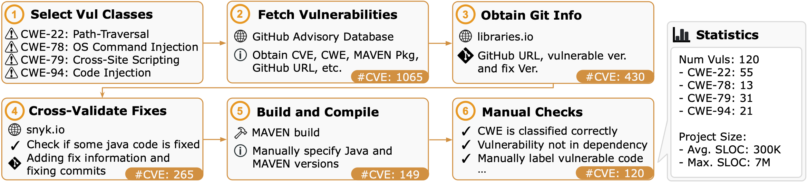

# CWE-Bench-Java

This repository contains the dataset CWE-Bench-Java presented in the paper [LLM-Assisted Static Analysis for Detecting Security Vulnerabilities](https://arxiv.org/abs/2405.17238).
At a high level, this dataset contains 120 CVEs spanning 4 CWEs, namely path-traversal, OS-command injection, cross-site scripting, and code-injection.
Each CVE includes the buggy and fixed source code of the project, along with the information of the fixed files and functions.
We provide the seed information in this repository, and we provide scripts for fetching, patching, and building the repositories.
The dataset collection process is illustrated in the figure below:



## Project Identifier

In this dataset, each project is uniquely identified with a **Project Slug**, encompassing its repository name, CVE ID, and a tag corresponding to the buggy version of the project.
We show one example below:

```
DSpace__DSpace_CVE-2016-10726_4.4
^^^^^^  ^^^^^^ ^^^^^^^^^^^^^^ ^^^
|       |      |              |--> Version Tag
|       |      |--> CVE ID
|       |--> Repository name
|--> Github Username
```

All the patches, advisory information, build information, and fix information are associated with project slugs.
Since there are 120 projects in the CWE-Bench-Java dataset, we have 120 unique project slugs.
Note that a single repository may be found to have different CVEs in different versions.

## Packaged Data

```
- data/
  - project_info.csv
  - build_info.csv
  - fix_info.csv
- patches/<project_slug>.patch
- advisory/<project_slug>.json
```

The core set of information in this dataset lies in two files, `data/project_info.csv` and `data/fix_info.csv`.
We also provide other essential information such as CVE advisory, build information, and patches for the projects to be compiled and built.
We now go into the project information and fix information CSVs.

### Project Info

| id | project_slug | cve_id | cwe_id | cwe_name | github_username | github_repository_name | github_tag | github_url | advisory_id | buggy_commit_id | fix_commit_ids |
| -- | ------------ | ------ | -------|----------|-----------------|------------------------|------------|------------|-------------|-----------------|----------------|
| 1 | DSpace__DSpace_CVE-2016-10726_4.4 | CVE-2016-10726 | CWE-022 | Path Traversal | DSpace | DSpace | 4.4 | https://github.com/DSpace/DSpace | GHSA-4m9r-5gqp-7j82 | ca4c86b1baa4e0b07975b1da86a34a6e7170b3b7 | 4239abd2dd2ae0dedd7edc95a5c9f264fdcf639d |

Each row in `data/project_info.csv` looks like the example above.
We now get into each field and explain what they are.

- `id`: an integer from 1 to 120
- `project_slug`: (explained in the previous section)
- `cve_id`: a common vulnerability identifier `CVE-XXXX-XXXXX`
- `cwe_id`: a common weakness enumeration (CWE) identifier. In our dataset, there is only `CWE-022`, `CWE-078`, `CWE-079`, `CWE-094`
- `cwe_name`: the name of the CWE
- `github_username`: the user/organization that owns the repository on Github
- `github_repository_name`: the repository name on Github
- `github_tag`: the tag associated with the version where the vulnerability is found; usually a version tag
- `github_url`: the URL to the github repository
- `advisory_id`: the advisory ID in Github Security Advisory database
- `buggy_commit_id`: the commit hash (like `ca4c86b1baa4e0b07975b1da86a34a6e7170b3b7`) where the vulnerability can be reproduced
- `fix_commit_ids`: the set of commit hashes (sequentially ordered and separated with semicolon `;`) corresponding to the fix of the vulnerability

### Fix Info

The `data/fix_info.csv` file contains the fixed Java methods and classes to each CVE.
In general, the fix could span over multiple commits, and a change could be made to arbitrary files in the repository, including resources (like `.txt`, `.html`) and Java source files (including core source code and test cases).
In this table, we only include the methods and classes that are considered core.
Many of the rows in this table is manually vetted and labeled.
Note that there may be fixes on class variables, in which case there will not be method information associated with the fix.
A single function may be "fixed" by multiple commits.

Each row in `data/fix_info.csv` looks like the following.

| project_slug | cve | github_username | github_repository_name | commit | file | class | class_start | class_end | method | method_start | method_end | signature |
|--------------|-----|-----------------|------------------------|--------|------|-------|-------------|-----------|--------|--------------|------------|-----------|
| apache__activemq_CVE-2014-3576_5.10.2 | CVE-2014-3576 | apache | activemq | `00921f22ff9a8792d7663ef8fadd4823402a6324` | `activemq-broker/src/main/java/org/apache/activemq/broker/TransportConnection.java` | `TransportConnection` | 104 | 1655 | `processControlCommand` | 1536 | 1541 | `Response processControlCommand(ControlCommand)` |

- `project_slug`: the unique identifier of each project
- `cve_id`: the CVE id
- `github_username`: the user/organization that owns the repository on Github
- `github_repository_name`: the repository name on Github
- `commit`: the commit hash containing this fix
- `file`: the `.java` file that is fixed
- `class`: the name of the class that is fixed
- `class_start`, `class_end`: the start and end line number of the class
- `method`: the name of the method that is fixed
- `method_start`, `method_end`: the start and end line number of the method
- `signature`: the signature of the method. Note that we might have multiple overloaded methods with the same name but with different signatures

## Fetch and Build Projects

We provide the scripts to fetch, patch, and build projects, assuming that you have a machine with any distribution of Linux x64.
In order to run the scripts, make sure that you have plenty of space on the host machine (as many projects can be very large).
Fetching repository requires that you have `git`, `wget`, and `python3` available on your system.

For building, we need Java distributions as well as Maven and Gradle for package management.
In case you have a different system than Linux x64, please modify `scripts/jdk_version.json`, `scripts/mvn_version.json`, and `scripts/gradle_version.json` to specify the corresponding JDK/MVN/Gradle files.
In addition, please prepare 3 versions of JDK and put them under the `java-env` folder.
This is due to that Oracle requires an account to download JDK, and we are unable to provide an automated script.
Download from the following URLs:

- JDK 7u80: https://www.oracle.com/java/technologies/javase/javase7-archive-downloads.html
- JDK 8u202: https://www.oracle.com/java/technologies/javase/javase8-archive-downloads.html
- JDK 17: https://www.oracle.com/java/technologies/javase/jdk17-archive-downloads.html

At this point, you should have a `java-env` directory that looks like

```
- java-env/
  - jdk-7u80-linux-x64.tar.gz
  - jdk-8u202-linux-x64.tar.gz
  - jdk-17_linux-x64_bin.tar.gz
```

Now, you can run our script using the command:

``` bash
$ python3 scripts/setup.py
```

This script will do the following things

- Create `build-info` and `project-sources` directories
- Install multiple JDK versions by unzipping your provided JDK distributions (in `java-env`)
- Install multiple MAVEN versions by automatically downloading and unzipping the MAVEN distributions (in `java-env`)
- Install multiple Gradle versions by automatically downloading and unzipping the Gradle distributions (in `java-env`)
- For each project in our dataset
  - Fetch the project into `project-sources/<project_slug>` directory
  - Build the project by trying multiple versions of JDK and MAVEN. The build information (whether it succeed or not) will be stored to `build-info/`

### Fetch without building

For those of you who do not want to build, you do not need to provide the JDK distributions.
Just directly run the following command:

``` bash
$ python3 scripts/setup.py --no-build
```

## Citation

Consider citing our paper:

```
@article{li2024iris,
      title={LLM-Assisted Static Analysis for Detecting Security Vulnerabilities},
      author={Ziyang Li and Saikat Dutta and Mayur Naik},
      year={2024},
      eprint={2405.17238},
      archivePrefix={arXiv},
      primaryClass={cs.CR},
      url={https://arxiv.org/abs/2405.17238},
}
```
